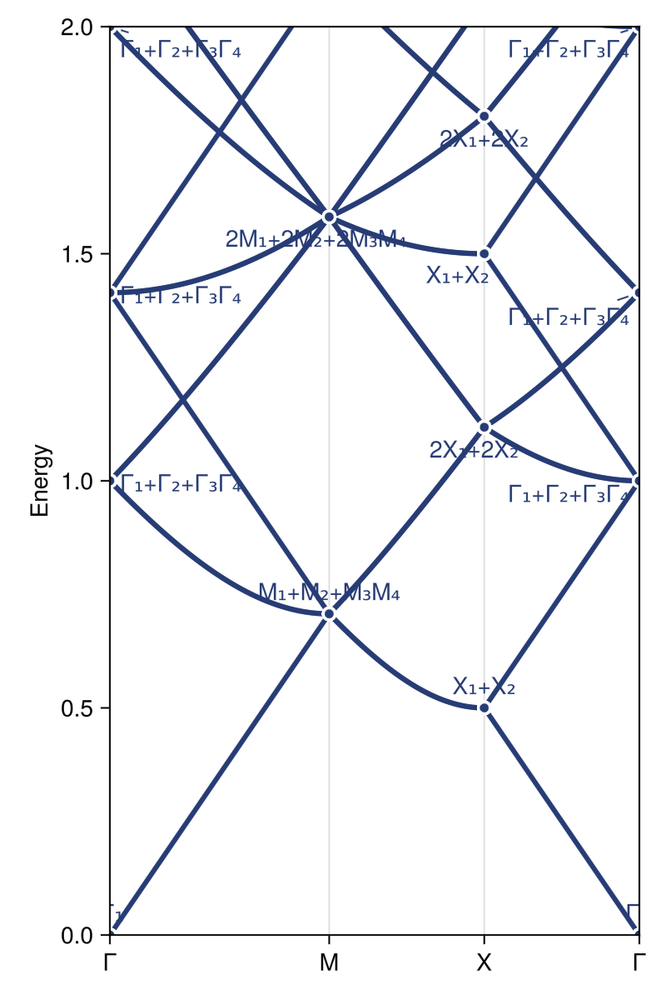

# EmptyLattice

Tools to compute photonic empty-lattice dispersion diagrams and associated symmetry properties (i.e., irreps).

## Example

To plot the empty-lattice band structure and simultaneously label the irreps at each of the high-symmetry **k**-points, we can leverage EmptyLattice.jl together with Crystalline.jl and Brillouin.jl:

```jl
using Crystalline, EmptyLattice, Brillouin

# pick a setting of interest (here, plane group p4)
sgnum = 10
D = 2
timereversal = true

# create direct/reciprocal bases & build a set of bandreps
cRs = directbasis(sgnum, D) # conventional direct basis
cGs = reciprocalbasis(cRs)  # conventional reciprocal basis
Gs = primitivize(cGs, centering(sgnum, D)) # primitive reciprocal basis (same in p4)

cbrs = calc_bandreps(sgnum, Val(D); timereversal) # bandreps in conventional setting
brs = primitivize(cbrs)                           # bandreps in primitive setting (same in p4)
lgirsv = irreps(brs)

# calculate a band structure along a k-path
kp = irrfbz_path(sgnum, cRs) # a k-path for p4
kpi = interpolate(kp, 1000)
_freqs = spectrum.(kpi, Ref(Gs); Nfreq=30) # `_freqs[i][n]`: k-point `kpi[i]` & band `n`
freqs = permutedims(stack(_freqs)) # convert to `[i,n]` matrix-indexing

# determine irrep labels at all high symmetry k-points referenced by `brs`
polarization = D == 3 ? nothing : :TM # pick `TM` polarization (choice necessary only in 2D)
annotations = collect_irrep_annotations(brs, Gs, polarization; Nfreq = size(freqs, 2))

# visualize
using GLMakie
plot(kpi, freqs; annotations, ylims=(0,2), figure=(; size=(300, 800)))
```

Which produces the plot below:
