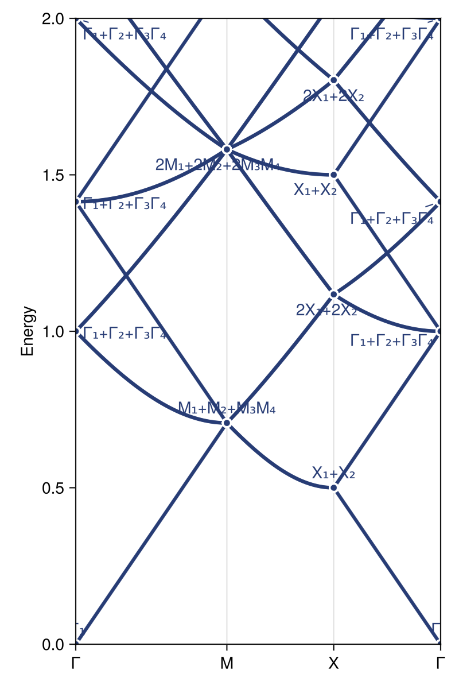
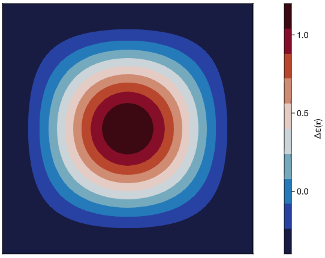

# EmptyLattice

Tools to compute photonic empty-lattice dispersion diagrams and associated symmetry properties (i.e., irreps).

## Example

To plot the empty-lattice band structure and simultaneously label the irreps at each of the high-symmetry **k**-points, we can leverage EmptyLattice.jl together with Crystalline.jl and Brillouin.jl:

```julia-repl
julia> using Crystalline, EmptyLattice, Brillouin

# pick a setting of interest (here, plane group p4)
julia> D, sgnum = 2, 10
julia> timereversal = true

# create direct/reciprocal bases & build a set of bandreps
julia> cRs = directbasis(sgnum, D) # conventional direct basis
julia> cGs = dualbasis(cRs)  # conventional reciprocal basis
julia> Gs = primitivize(cGs, centering(sgnum, D)) # primitive reciprocal basis (same in p4)

julia> cbrs = calc_bandreps(sgnum, Val(D); timereversal) # bandreps in conventional setting
julia> brs = primitivize(cbrs)                           # bandreps in primitive setting (same in p4)
julia> lgirsv = irreps(brs)

# calculate a band structure along a k-path
julia> kp = irrfbz_path(sgnum, cRs) # a k-path for p4
julia> kpi = interpolate(kp, 1000)
julia> _freqs = spectrum.(kpi, Ref(Gs); Nfreq=30) # `_freqs[i][n]`: k-point `kpi[i]` & band `n`
julia> freqs = permutedims(stack(_freqs)) # convert to `[i,n]` matrix-indexing

# determine irrep labels at all high symmetry k-points referenced by `brs`
julia> polarization = D == 3 ? nothing : :TM # pick `TM` polarization (choice necessary only in 2D)
julia> annotations = collect_irrep_annotations(brs, Gs, polarization; Nfreq = size(freqs, 2))

# visualize
julia> using GLMakie
julia> plot(kpi, freqs; annotations, ylims=(0,2), figure=(; size=(400, 600)))
```

Which produces the following visualization of the empty-lattice band structure:

<div align="center">
p</it>4" width="400"/>
</div>

## Perturbation Theory

The `PerturbationTheory` submodule computes first-order frequency shifts Δω<sup>(α)</sup> for a weak dielectric perturbation Δε(**r**) = Σ<sub><b>b</b></sub> Δε<sub><b>b</b></sub> e<sup>i<b>b</b>·<b>r</b></sup>:

<div align="center">
Δω<sup>(α)</sup> = −(ω/2ε) Σ<sub>[<b>b</b>]</sub> <it>A</it><sup>(α)</sup><sub>[<b>b</b>]</sub> · Δε<sub><b>b</b></sub>
</div>

where [<b>b</b>] denotes summation over a canonical representative of the symmetry-related Fourier coefficients in Δε(**r**), and where the coefficients <it>A</it><sup>(α)</sup><sub>[<b>b</b>]</sub> are determined by the symmetry of the empty-lattice state at irrep α.

### Example: plane group p4, M-point (TM polarization)

```julia-repl
julia> using Crystalline, EmptyLattice, EmptyLattice.PerturbationTheory

julia> D, sgnum = 2, 10  # plane group p4

julia> Rs    = primitivize(directbasis(sgnum, Val(D)), centering(sgnum, D))
julia> Gs    = dualbasis(Rs)
julia> lgirs = lgirreps(sgnum, Val(D))["M"]   # irreps at M = [½, ½]

# compute symbolic shift expressions for all irreps at the lowest degenerate frequency
julia> degeneracy_idx = 1 # which "degeneracy bundle" in the empty lattice to consider (1 = lowest)
julia> es = frequency_shifts(lgirs, Gs, degeneracy_idx; polarization=:TM)
4-element Collection{IrrepShiftExpr{2}} (TM, ω ≈ 0.7071):
M₁: Δω = -(ω/2ε) (2Δε[1,0] + Δε[1,1])
M₂: Δω = -(ω/2ε) (-2Δε[1,0] + Δε[1,1])
M₃: Δω = -(ω/2ε) (-Δε[1,1])
M₄: Δω = -(ω/2ε) (-Δε[1,1])

# inspect a single shift for more info
julia> es[1]
M₁: Δω = -(ω/2ε) (2Δε[1,0] + Δε[1,1])
  orbits:
    Δε[1,0] = Δε[0,1] = Δε[0,-1] = Δε[-1,0]
    Δε[1,1] = Δε[1,-1] = Δε[-1,1] = Δε[-1,-1]

# evaluate shift (Δωa/2πc) for concrete choices of canonical Fourier components Δε₁₀, Δε₁₁
julia> ε = 1.44^2 # constant background permittivity of empty lattice before perturbation
julia> Δε₁₀, Δε₁₁ = 0.2, 0.1
julia> Δω = evaluate(es, Dict([1,0] => Δε₁₀, [1,1] => Δε₁₁), ε)
Dict{String, Float64} with 4 entries:
  "M₃" => 0.0170502
  "M₄" => 0.0170502
  "M₂" => 0.0511507
  "M₁" => -0.0852511
```

When an irrep appears with multiplicity *M* > 1 (e.g. at a non-symmorphic **k**-point or in 3D where two transverse polarizations are degenerate), `frequency_shifts` returns a `DoubletShiftExpr` (*M* = 2) or `MultipletShiftExpr` (*M* ≥ 3) instead of `IrrepShiftExpr`.
`evaluate` then returns `Dict{String, Vector{Float64}}` — one sorted vector of *M* eigenvalues per irrep.

For more examples (including *M* > 1 and 3D), see [`docs/examples/perturbation_theory_demo.jl`](docs/examples/perturbation_theory_demo.jl).

### Visualizing the dielectric perturbation

In 2D settings, and with a Makie backend loaded, the real-space dielectric profile can be plotted directly from the orbit data:

```julia-repl
julia> using GLMakie
julia> os = orbits(es)                       # OrbitRelations for each b-orbit
julia> plot_dielectric(os, [Δε₁₀, Δε₁₁], Rs) # contourf over the 2D unit cell
```

<div align="center">
p</it>4" width="400"/>
</div>